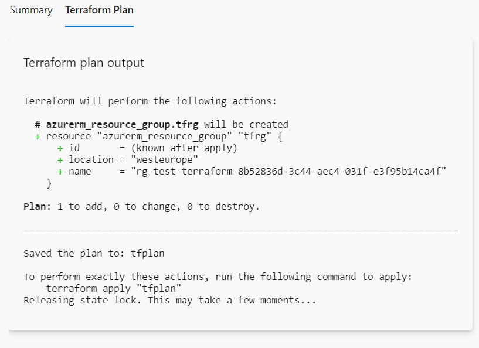
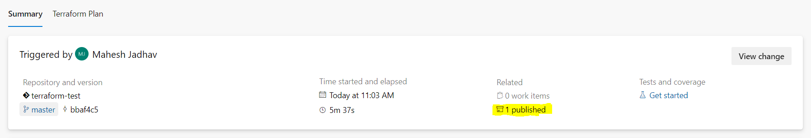
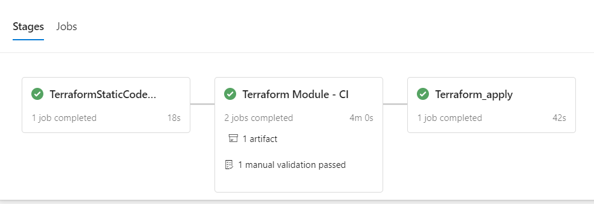

# Terraform CICD

## Pre-requisites

1. Add terraform plugin [Azure Pipelines Terraform Tasks by Charles Zipp](https://marketplace.visualstudio.com/items?itemName=charleszipp.azure-pipelines-tasks-terraform)

2. Create Service connection using Azure Service Principle named - terraform-onedeliverea-subscope-connection

## Tasks

The CICD pipeline defined in azure-pipline.yaml has below steps

1. Terraform static code analysis using checkov

2. Terraform code continuous integration with
   1. terraform install
   2. terraform init
   3. terraform validate
   4. terraform plan 

3. Terraform plan output will be saved in artifact - tfplan.json also will be displayed in ADO 'Terraform Plan'

Artifact - 

   
1. Manual validation will be required to check and validate terraform plan 

2. Once manual validation is approved, terrform apply will be triggered to apply the changes

